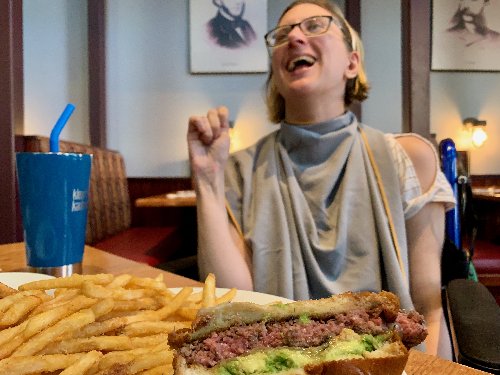
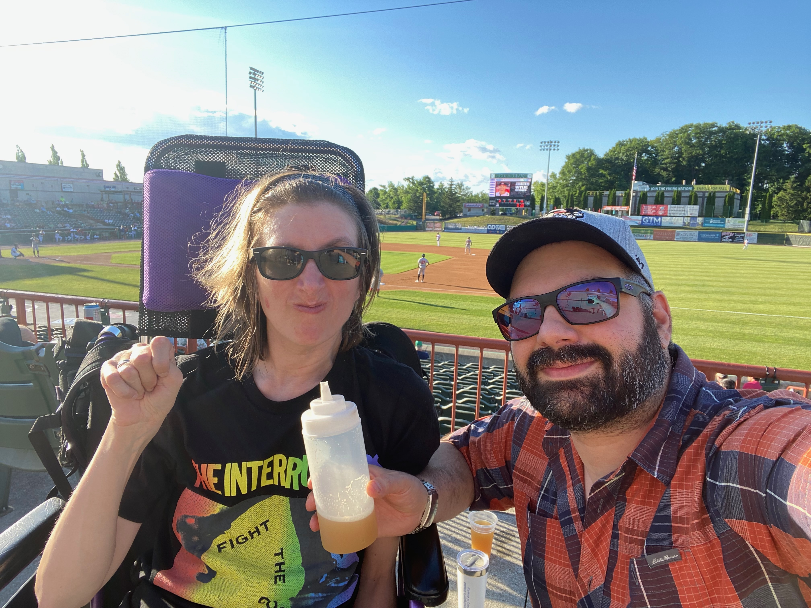

slide-dividers: #, ##
footer: July 23, 2022 | Help 4 HD HIPE Virtual | A Journey to Finding Tips and Tricks | Joe Esposito | joe@j-espo.com

# A Journey to Finding   Tips and Tricks
[.footer:]

[.autoscale: true]
## A Talk by Joe Esposito
- A Caregiver, Techie, and Over Thinker
- These are all anecdotes!
- Feel free to reach out!
	- [joe@j-espo.com](mailto:joe@j-espo.com)
	-  [Facebook](http://facebook.com/esposj)

^ In this slide, I'll do a quick introduction about me, share and invite folks to reach out and reinforce the fact that this is all trial and error and things that have worked for our house hold.  Our HD loved ones play a critical role in allowing us to help. Caveat empor. 

## A Quick Introduction
[.autoscale: true]
[.column]
### A bit about Nora and I
- [Help4HD 20 Questions](https://www.help4hd.org/post/20-questions-with-help-4-hd-joe-esposito)
- [LetsTalkAboutHD](https://albany.hdsa.org/news/-letstalkabouthd-with-joe-esposito)
- In it together
- Easy going

[.column]
### Key Areas
- Force Multipliers
- Household Tips 
- Kitchen Tips

^ Our story has been pretty well documented, but the key brief timeline is that we met in high school in 1997, got married in 2005.  Nora stopped working in 2011, started using a wheelchair in 2018, started needing significant help with all ADLs in 2020, and this summer started a blended diet. Along the way we've learned quite a few tricks that I'm going to share today.

^ We're going to talk about three main areas where my tips help out across the 3 common stages of HD. Force multipliers are my favorite.  Using technology has allowed additional independence early on, and continues to allow me to balance remote work and caregiving well into the late stage of HD.  Household hacks will include early planning we did when HD was just on the horizon, accommodations for living with HD, and ways that I've been able to save time.  Many of these come at a financial cost, which is dwarfed by the savings of not having paid help in the house.  Finally some tips from my kitchen and travel bag to make feeding our HD loved ones a bit easier.

---
[.footer:]

## Early Stage - Force Multipliers
- GPS Tracking 
	- [Apple Find My](https://support.apple.com/en-us/HT210514)
	- [Google Location sharing](https://support.google.com/maps/answer/7326816?hl=en&co=GENIE.Platform%3DAndroid)
- Fall Detection
	- [Apple Watch](https://support.apple.com/en-us/HT208944)
	- [Samsung Watch](https://www.samsung.com/us/support/answer/ANS00087244/)
- [Driver Tracking](https://www.kbb.com/car-advice/monitoring-teen-driving/)	

^ Nora was able to give up driving in 2010.  She stopped working and was approved for disability in May 2011.  For the next 3-4 years she was fairly independent at home.  She would routinely go for multi mile walks including daily trips to the YMCA.  We agreed that me knowing where she was would allow her to keep her independence.  We leveraged the iPhone with location tracking.  It came in handy a few times.  

^ We didn't have access to smart watches with fall detection at the time, but today, I'd push for that for sure!.  We also didn't have too man issues with her driving.  She voluntarily gave up driving pretty soon after 2 minor fender benders.

## Early Stage - Household Tips
- Planning for the future
	- [House Hacking](https://www.forbes.com/sites/davidgreene/2018/12/04/house-hacking-how-financially-savvy-people-live-in-expensive-markets-while-saving-money/?sh=36525c5370f0)
	- [Walkable Neighborhoods](https://www.walkscore.com)
- Don't Wait - Do it now!
	- Travel

^ Truth be told, this section makes a lot more sense in hind sight, but would also make a great plan for a young couple with a prognosis on the horizon.  Our version of house hacking was a 2 family house.  In the early years, our tenants paid the mortgage.  I turned out to not be a great land lord and made the mistake of leaving it vacant and eventually selling the building instead of hiring a property manager.  Lessons learned!

^ That first house was in a very walkable town.  As mentioned, the YMCA, shops, and a beautiful college campus were all less then a 15 minute walk away. The high walk score went a long way to allowing Nora independence after she stopped driving.

^ We found ways to travel quite a bit in this stage.  We funded a lot of this with me delaying retirement savings and some help from family.  Later on, I took a new job which had a monthly travel requirement.  Nora traveled with me, often on points earned from my business expenses.  This worked our really well from 2014-2018 when it became unsafe to leave her alone in the hotel rooms. Those middle stage falls took their toll.

---
[.footer:]

## Mid Stage - Force Multipliers
- [Spoken](https://www.audible.com) [Word](https://benningtonshow.com) [Media](https://atp.fm)
- [Cameras / Motion Detection](https://smile.amazon.com/Amcrest-Security-Two-Way-4-Megapixel-IP4M-1041B/dp/B095XCGKTF/)
- [Coud Baby Monitor App](https://cloudbabymonitor.com)
- [Call](https://smile.amazon.com/dp/B09SPSK3V6) [Buttons](https://smile.amazon.com/dp/B09WDB3NFY) & ([more options](https://www.the-ambient.com/buyers-guides/best-smart-home-buttons-alexa-homekit-google-smartthings-2527))
- [Alexa 'Drop In'](https://www.amazon.com/alexa-drop-in-calling-intercom/b?ie=UTF8&node=21393410011)

^ The first force multiplier is for me!  In the middle stage, the caregiver burden really starts.  Work, household chores, kitchen tasks, increased assistance with ADLs all start to take their time.  I found audiobooks, radio shows, and podcasts to be a lifesaver in allowing me time for entertainment while doing all of these things.  Noise cancelling headphones help block out hours of TV watching for our loved ones.

^ I was 7 years ahead of the work from home transition that happened for many during Covid.  I went looking for a remote career before it was needed, knowing it may take some time or even a false start.  I got lucky and have been at the same company for the past 9 years.  These tools allowed 

## Mid Stage - Household Tips
- Be Flexible! 
- Things change fast
- 'Active Sleep' Solutions
	- [Railings](https://www.amazon.com/gp/product/B000GUFFQS) or [Bumpers](https://www.amazon.com/gp/product/B077H8ZFK6)
	- Consider a separate bedroom
- Plan accommodations
	- wheelchair accessibility
	- bathroom accessibility 
	
	
## Mid Stage - Kitchen Tips
- Food Processors and soft foods
- Cups with Lids and Straws

---
[.footer:]

## Late Stage - Force Multipliers
- Active Monitoring 
- [Delivery](https://www.instacart.com/store) [Services](https://www.grubhub.com) (Cheaper then in home care!)

## Late Stage - Household Tips
- [Extra](https://www.amazon.com/gp/product/B0881XD6J9/) [Linens](https://www.amazon.com/gp/product/B08DKBYZH8) == Less Laundry
- Build your own [Supply Chain](https://www.amazon.com/Subscribe-Save/b?ie=UTF8&node=5856181011)
- Unconventional Layouts
- [Music!](https://music.apple.com/us/playlist/pure-calm/pl.ffc344338c3d4ff394ddcf94d766c143)

## Late Stage - Kitchen Tips
[.autoscale: true]
[.column]
### Some Ideas
- Cream of wheat, eggs, milk + flavor
	- maple syrup + vanilla = pancake batter
	- peppers + ham = western
	- PB&J
- Smoothies (whole milk yogurt, fruit, spinach)
- weekly roast chicken + frozen veggies

[.column]
### Tips
- Coming Soon - [Help4HD Cookbook](https://www.help4hd.org/hd-cookbook)!
- [Track Macros](http://carbmanager.com)
- Show the Plate before blending
- Taste it and say yum!
- Use [Squeeze Bottles](https://smile.amazon.com/Condiment-OAMCEG-Measurements-Condiments-Dressings/dp/B083LQLVBM/)
- Pasta doesn't blend well.
- Calorie Boosters
	- Iced coffee w/ protein powder and heavy cream
	- powdered potatoes in soups

